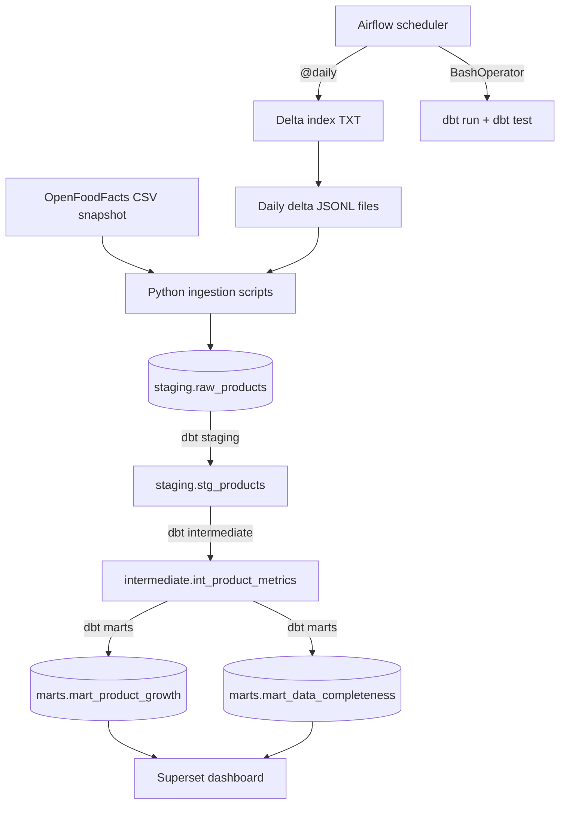

# Arhitektuur

## Äriküsimus

Kui hästi katab [Open Food Facts andmebaas](https://world.openfoodfacts.org/discover) Eesti turul müüdavaid toidutooteid ja kui terviklikud on nende andmed?

## Mõõdikud

1. Eestis müüdavate toodete koguarv andmebaasis
2. Lisanduvate toodete arv päevas
3. Andmete terviklikkus: toodete arv/osakaal, millel on olemas:
   1) energia ja peamiste toitainete sisaldus,
   2) koostisosade nimekiri,
   3) pakendi materjal,
   4) kogus (netomass/ruumala vmt).

Võimalusel arvutame mõõdikud ka tootekategooriate lõikes.

## Andmeallikad

| Allikas | Tüüp | Ajas muutuv? | Roll |
|---------|------|--------------|------|
| OpenFoodFacts andmebaas | CSV| Jah, iga päev | Algne andmestiku laadimine |
| OpenFoodFacts delta loend | TXT | Jah, iga päev | Andmestiku uuendamine |
| OpenFoodFacts päeva delta | JSONL | Jah/Ei (iga deltafail eraldi on staatiline, aga iga päev lisandub uus fail) | Andmestiku uuendamine |

## Andmevoog

## Andmebaasi kihid

| Kiht | Roll |
|------|------|
| `staging.raw_products` | Tabel | OpenFoodFacts CSV snapshotist ja delta JSONL failidest loetud Eesti toodete toorandmed |
| `staging.stg_products` | Vaade | Puhastatud ja standardiseeritud tootetabel (kuupäevad, kategooriad, riigid ja toitainete väljad) |
| `intermediate` | Vaade | Vahemõõdikud ja andmete terviklikkuse arvutused dashboardi KPI-de jaoks |
| `marts` | Tabel | Agregeeritud KPI- ja analüütikatabelid, mida kasutab näidikulaud |

## Tööjaotus

| Roll | Vastutus | Täitja |
|------|----------|--------|
| Andmeallika omanik | Kirjutab sissevõtu ja puhastamise loogika, häälestab Airflow DAG-id | Karl Räim |
| Transformatsioonide omanik | Kirjutab intermediate/marts kihi mudelid ja mõõdikute arvutuse | Maarja Kukk |
| Kvaliteedi omanik | Kirjutab testid ja vaatab läbi ebaõnnestunud kontrollid | Maarja Kukk, Anni Marie Maripuu |
| Näidikulaua omanik | Ehitab näidikulaua ja seob selle äriküsimusega | Anni Marie Maripuu, Marge Saamel |

## Riskid

| Risk | Mõju | Maandus |
|------|------|---------|
| Delta failide ühendamine staatilise andmebaasiga | Töövoogu ei õnnestu seadistada või see võib ootamatult katkeda | Tutvume failide sisuga ja testime failide ühilduvust esimesel võimalusel |
| Andmeallika napp metainfo | Ootamatute tunnuse väärtuste tõttu võib töövoog katkeda või mõõdikud näitavad väära infot | Tutvume andmebaasi algseisuga ja seadistame töövoos sobilikud kvaliteedikontrollid |
| Ajaressurss | Vajalikud tegevused pole projekti vahe- ja/või lõpptähtaegadeks valminud | Jagame konkreetsed tööülesanded vastavalt meeskonnaliikmete oskustele ja võimalustele ning suhtleme jooksvalt |

## Privaatsus ja turve
Projektis ei kasutata isikuandmeid. Andmebaasi paroolid tulevad `.env` failist. 
[Kirjelda, millised isiku- või tundlikud andmed teie projektis esinevad (kui üldse) ja kuidas neid kaitsete. Isikuandmed peavad olema anonümiseeritud. Andmebaasi paroolid peavad tulema `.env` failist.]
